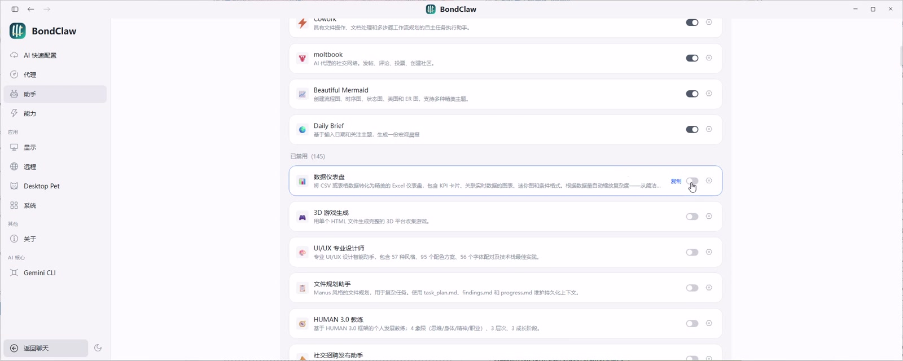

# BondClaw

`BondClaw` 是一个面向专业固收投研人员的开放项目。

整个项目的核心思路是“工程化研究”。

过去我们知道，在 AI 领域，目前应用最广、应用价值发挥率最高的就是编程领域。实际上，编程之所以能很好地发挥 AI 的效用，是因为它是数字化的，整个过程高度可工程化。由此可以衍生出一个思路：任何一项深度专业的工作，要让 AI 发挥更大价值的前提，就是让工作本身更好地用工程化架构来重构。

研究工作本身其实已经具有高度工程化的潜力。我们整个流程从信息和数据的收集整理、分析框架的搭建，到基于框架的分析，以及持续的经验知识库累积循环，最后到输出展示、反馈、再循环的积累提升过程。

整个研究过程如何赋能并体现为实际投资价值，核心点在于研究需要做成“可复现、可回溯、可回测”。如果你能将研究工作工程化，就能将从研究到投资的整个价值链条搭建得非常清晰，这也是我们构建这个项目的出发点。

在过去的使用过程中我发现，相比于市场上最近出现的 OpenClaw 这种工具，编程领域中一些更专业化的工具，在应对深度专业工作时的价值远比 OpenClaw 这种架构更为强大。OpenClaw 之所以能火，核心原因在于它面向的是更广大的人群，做得更通俗。但实际上，专业研究人员需要的是更为工程化的编程工具。

问题在于，很多研究人员并不具备代码基础，很难直接安装和使用这些专业工具。所以我们的思路是：借鉴 OpenClaw 在使用体验上的优势，构建了一个 BondClaw。它与 OpenClaw 最大的差异在于两点：

1. 底座不同：它的底座不是 OpenClaw，而是那些专业的代码工具，是彻底代码化、编程化、工程化的。
2. 内嵌经验：它内嵌了很多资深研究员过去十几年积累下来的工作流程，并将其转化为特定的 Skill。

我们将这种从研究到投资的工程化探索思路和认知，体现在了项目设计的方方面面，因此能带来相比市场其他工具不一样的体验。

它不是单点工具，而是一套从信息收集、文档解析、附注优先分析，到结构化输出、知识沉淀、订阅分发和无代码工作流编排的协作底座。

## 使用演示视频

下面这段演示视频展示了一个完整案例：使用 BondClaw 分析中国建筑最新财报，并在约 20 分钟内形成规范详尽的财务分析底稿。

- 当前版本：2 倍速压缩版
- 时长：约 4 分 50 秒
- 文件大小：约 20.8 MB

- 在线播放/打开视频：[`bondclaw-demo-cn-buildings-2x.mp4`](docs/assets/videos/bondclaw-demo-cn-buildings-2x.mp4)
- 封面图：[`bondclaw-demo-cn-buildings-cover.jpg`](docs/assets/videos/bondclaw-demo-cn-buildings-cover.jpg)

## 许可

本仓库仅限非商业使用。任何商业使用、转售、再许可、付费托管、商业集成都不允许，除非得到权利人事先书面许可。详见 [LICENSE](LICENSE)。
