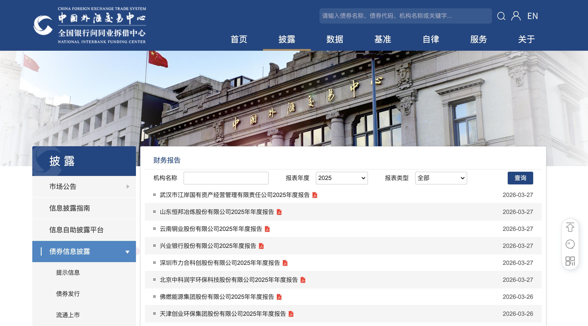
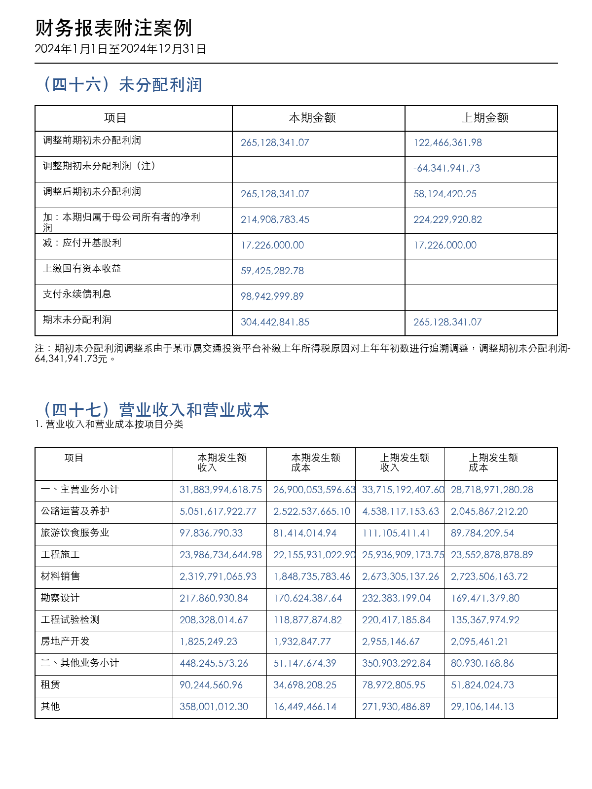
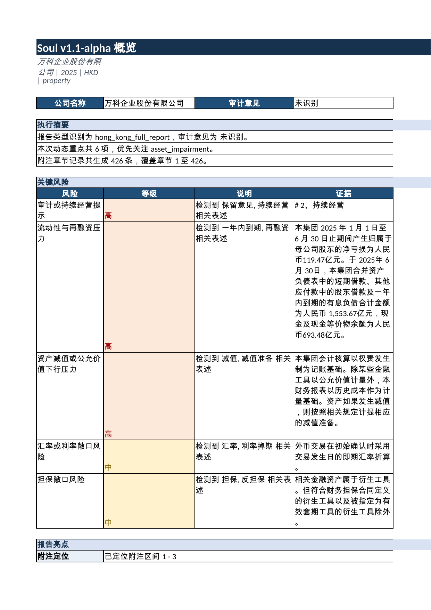

# 信用债研究工作流介绍

## 1. 信用债研究工作流

信用债研究的核心目标，是评估企业发行债券的信用资质。它本质上是在不同主体之间做排序和评级：谁更稳，谁更脆弱，谁的风险已经被市场充分定价，谁仍然存在被低估或高估的可能。这个判断看似是一个结论，实际上来自一整套连续的观察、比对和校准过程。

信用研究并不从“债券”本身开始，而是从债券背后的主体开始。债券是载体，主体才是信用的真正承载者；现金流是支撑，条款是约束，市场价格则是不断回传的反馈。只有把这些要素放在同一框架下，信用判断才不会停留在单一指标或单一时点上。

这一套逻辑并不抽象。深交所、交易商协会和中国外汇交易中心都把债券信息披露、存续期管理和市场数据放在同一条业务链上：一端是发行文件、定期报告和临时报告，另一端是成交、收益率曲线和存续期服务；两者共同决定研究能否回到可验证的事实基础。深交所固收类规则页、NAFMII的信息披露与存续期服务入口，以及 ChinaMoney 的债券价格与曲线页面，实际上就构成了信用研究最常见的外部信息底座。

### 数据收集

数据收集是信用研究的起点，也是最基础、同时最容易被低估的一环。这里的数据并不只有报表数字，还包括结构化数据与非结构化数据两大类。前者如财务报表、债务余额、期限结构、发行规模、收益率和成交数据；后者如公告、舆情、评级报告、调研纪要、会议纪要以及政策文件。

其中，最关键也最困难的部分往往不是正文报表，而是财报附注、说明文字和其他非标准化内容。主体的真实债务结构、担保安排、受限资产、回售赎回条款、融资用途、重大事项披露，常常都藏在附注和注释里。报表正文提供规模，附注提供结构；正文能看出“有多少”，附注才能看出“是什么、怎么形成、受什么约束”。因此，信用研究对附注的依赖，远高于对单纯汇总表的依赖。

这一点在监管与披露体系里有明确映射。交易所债券业务规则、NAFMII 的发行文件与持有人会议、存续期披露页面，都把发行、定期披露和重大事项披露拆成了明确门类；这意味着研究不能只依赖摘要，更不能只看一张报表。更稳妥的做法，通常是用年报附注、募集说明书、评级报告和交易所或协会公告互相对照；用成交数据、估值曲线和市场行情互相印证；再用企业披露与第三方数据库、新闻数据库、舆情材料互相补充。单一来源可以形成线索，但不足以支撑正式结论。

### 信息分析

数据收集完成之后，下一步不是简单汇总，而是信息分析。信息分析的核心，不是把材料压缩成摘要，而是把分散的信息整理成可回溯、可检索、可复核的非标准化数据库。对信用研究而言，真正有价值的不是“知道过了什么”，而是“为什么这样判断、依据在哪里、以后怎么回头核对”。

这一层通常会把年报、附注、公告、评级报告、调研纪要等内容重新组织，建立主题索引、证据索引和非结构化记录。研究不是在这里寻找一个简单答案，而是在这里把线索拆开、归类，再重新拼回到主体、时间和事件链条上。很多信用变化并不直接体现为财务比率的剧烈波动，而是先体现在文字、表述、口径、条款与舆情中。

这类附注图的作用，是把“未分配利润如何结转”“收入和成本按什么项目拆开”这种最容易被忽略的结构，直接放到图上看。真正做信息分析时，研究员关心的不是有没有数字，而是数字从哪里来、怎么流转、和哪一部分业务对应。

这个过程也可以从市场基础设施侧得到佐证。ChinaMoney 页面上展示的是活跃债券价格、回购利率、Shibor、LPR 和利率互换曲线，说明市场本身并不只提供一个“价格”，而是提供一组随时间更新的信号。信用研究的任务，不是把这些信号简单拼接，而是把它们放回到主体、条款和期限结构中去解释。

### 评级分析

评级分析是信用研究里最像“判断”的部分，也最依赖经验。它不是机械地把主体套进一个分数模型，而是在财务、现金流、行业景气度、区域环境、融资渠道、条款结构和市场反馈之间，形成相对稳定的排序。

同样的财务数据，在不同主体上往往有不同含义。负债率高，未必一定差；现金流弱，也未必立刻意味着信用恶化；某些行业的高杠杆是经营模式决定的，某些主体的资产扩张则可能对应更强的融资弹性。因此，评级分析的关键，不是“有没有分数”，而是“分数背后的解释是否能够经得住比较”。

监管与协会体系也在不断强调这一点。证监会与交易商协会的公开信息中，持续可以看到注册发行、信用评级、信息披露、存续期管理和市场化评议等制度安排；这说明评级并不是孤立结果，而是与主体信息披露、发行行为和后续市场反馈共同构成闭环。评级分析通常会同时依赖两条路径：一条是评级方法和历史样本形成的框架，另一条是研究员对主体所处阶段、行业特征和事件冲击的判断。前者提供稳定性，后者处理偏离与例外。没有经验，评级会僵硬；完全依赖经验，评级又会失去可比性。真正可用的评级，通常是在这两者之间找到平衡。

### 投资决策

评级并不直接等于投资结论。信用好，不等于值得买；信用一般，也不必然意味着不能买。投资决策看的是性价比，即在既定信用档位下，收益率、流动性、期限、条款与替代品之间是否匹配。

这一步通常要把主体判断进一步落到债券层面。不同债券即使来自同一主体，条款和价格也可能差异很大：是否有回售、赎回、加速到期、担保安排、分期偿还、特殊触发条款，都会改变风险收益关系。与此同时，市场定价也会给出即时反馈。募集说明书、债券条款、交易所披露、成交数据、估值曲线和同类券比较，往往需要放在一起看，才能判断某一只债是“便宜”、是“合理”，还是“风险补偿仍然不足”。

这一层与市场基础设施的关系也很直接。交易所的债券信息披露栏目、NAFMII 的发行文件和持有人会议、ChinaMoney 的债券价格与曲线数据，本质上对应的是同一条定价链：发行时看条款，存续时看信息，交易时看价格。投资决策不是从评级直接跳到买入，而是先确认信用边界，再观察条款保护与市场定价，最后才形成是否配置、配置多少、配置到什么位置的判断。

### 持有期管理

信用研究并不在买入时结束。主体一旦进入持有阶段，研究就转入持续观察：财务是否继续改善或恶化，融资是否顺畅，评级是否变化，舆情是否出现新的压力，市场价格是否提前反映风险。

持有期管理的价值在于，它把一次性判断变成一个有反馈的过程。许多信用风险不是在最初判断时显现，而是在后续的融资收缩、经营波动、政策变化或市场再定价中逐步暴露。定期更新信息、监控风险信号并做出后续决策，是信用研究闭环中不可缺的一段。没有这一段，前面的评级和投资结论就只能算时点快照，而不是持续有效的信用判断。

持有期管理也最能体现市场数据与披露数据的结合方式。NAFMII 的存续期服务系统提供公告查询、持有人会议和排查业务，深交所固收类规则页则把债券临时报告、定期报告和信息披露细项继续拆分；另一方面，ChinaMoney 的收益率曲线、回购利率和活跃债券价格提供了持续监测的市场反馈。信用研究若想形成真正的闭环，不能只记住买入时的判断，还要跟踪随时间变化的披露和价格。

### 房地产行业案例

以下图样来自公开年报抽图、行业研究页和本地分析页，用来说明信用研究里最常见的三类入口：总览页、风险/附注表格页、商业物业场景页。它们不是会议纪要，而是把同一行业的不同证据层次摆在一起。

## 2. 房地产行业案例

信用研究是否成立，通常不靠概念，而靠案例。以下样本可以合并为一个房地产行业案例：同样处在地产行业，信用分层却由现金可得性、债务期限、审计质量、政府支持和融资成本共同拉开。这里的结论均来自年报原文与对应的财务分析底稿，并与市场披露、交易规则和存续期信息做过交叉核对。

### 2.1 房地产行业案例：四种信用位置

商业地产运营样本的收入为 112.42 亿港元，现金及银行存款 103.03 亿港元，现金短债比 1.09x，净负债率 21.2%，利息保障倍数 4.05x。一年内到期债务升至 93.40 亿港元，较前一年明显上行，但流动性仍保持充足。

民营开发样本的审计意见为无法表示意见，自由现金约 13.6 亿元，受限资金约 175.6 亿元，一年内到期有息债务超过 734 亿元，其他应收款净额约 2334.57 亿元，存货跌价准备约 757 亿元。这里的信号不是单点恶化，而是多个指标同时收敛到同一方向。

区域平台样本的收入为 12.51 亿元，净利润 0.81 亿元，政府补助 6.62 亿元，有息债务约 466 亿元；存货以土地一级开发、代建项目和保障安置房为主，应收政府组合约 16 亿元且不计提坏账。它更接近准财政逻辑，而不是纯市场化地产逻辑。

央企开发样本的总资产为 6128.66 亿元，净负债率 7.0%，现金短债比 3.79x，融资成本约 2.25%~3.60%，受限资金比例仅 0.16%，存货跌价率仅 0.33%。同样是地产行业，但资本结构、现金可用性和融资能力明显不同。

这个合并样本说明，信用研究的重点不是把地产行业看成一个平均数，而是先分清主体类型，再看现金、债务、条款和支持体系各自怎么起作用。行业可以相同，信用位置并不相同。

## 3. AI工具嵌入工作流总体思路

AI 工具在信用研究中的价值，首先体现在效率上。面对海量年报、公告、政策文本、调研纪要和舆情信息，AI 可以帮助完成初筛、归类、抽取和提示，把研究过程中最耗时的机械环节压缩掉。尤其是在处理非结构化数据时，AI 能够显著改善信息搜集和初步整理的速度，让研究更快接触到关键材料。

从已有的房地产行业样本看，AI 的价值并不只是“提取速度更快”，更重要的是把原本要手工分散完成的步骤拉回到同一条链路上。商业地产运营样本里，利息资本化、公允价值变动、短债到期和现金覆盖散落在不同附注；民营开发样本里，自由现金、受限资金、存货跌价、其他应收款和审计意见分属不同章节；区域平台样本里，政府补助、专项应付款、债务置换和政府回款又属于另一套口径。AI 可以把这些片段先聚合起来，但不能替代最终判断。

在更理想的情况下，AI 还可以帮助建立风险预警线索。它可以从密集文本中识别反复出现的风险表述，从多份材料中抽取同类字段，或在市场与公告之间寻找变化轨迹。此类能力并不直接替代判断，但能够让潜在风险更早进入观察范围。证监会、深交所和交易商协会的公开页面都不断强化信息披露、存续期管理和市场化监管的要求，这也意味着AI最适合嵌入的是“整理、检索和提示”，不是“替代责任”。

不过，AI 在信用研究中的边界同样清楚。当前这类工作流仍然高度依赖主观经验和模糊判断，尤其是在评级分析和投资收口阶段。很多判断并不存在唯一答案，更多是基于证据权重、行业经验和对事件脉络的综合把握。AI 可以给出候选解释，但如果直接把它当成最终结论，安全性和准确性都会受到影响。

另一个挑战来自市场本身的变化。传统行业主体的信用状况已经在多年市场化运行中形成较稳定的观察框架，但新行业主体，尤其是科创企业、轻资产平台和商业模式变化较快的主体，往往缺少足够成熟的定价基准。NAFMII 近期围绕科技创新债券、基础层企业注册发行机制和市场化评议持续优化，也从侧面说明信用定价并非静态完成，而是在制度和市场双重变化中不断修正。历史评级框架在这些对象上不一定完全失效，但会面临明显的校准压力：同样的财务口径，未必对应同样的信用含义；同样的增长速度，也未必对应同样的偿债能力。

因此，AI 更适合被理解为一种增强工具，而不是替代工具。它可以提高数据收集、信息分析和风险预警的效率，但不能替代对主体、条款和市场环境的最终判断。真正稳定的做法，是让 AI 处理重复和广覆盖的部分，让研究结论仍然回到可核验的证据、可解释的框架和可比较的市场结果上。

## 4. 参考来源

以下来源被用来交叉验证信用研究中最常见的信息入口，行业不限：

1. 企业官方网站和投资者关系页面：公告、定期报告、临时公告、ESG 报告、投资者演示材料、电话会纪要与路演材料。
2. 财务报告与审计资料：年报、半年报、季报、审计报告、财务报表附注、募集说明书、募集资金使用报告。
3. 评级机构报告：主体评级报告、债项评级报告、跟踪评级报告、信用观察名单、评级方法说明。
4. 市场与数据库终端：WIND、同花顺、企业预警通、企查查，以及同类数据库中的估值、成交、工商、司法、舆情和舆情追踪信息。
5. 交易所和协会信息披露平台：债券发行、定期披露、临时披露、持有人会议、付息兑付、存续期管理等公开入口。
6. 中国货币网和银行间市场相关页面：财报查询、债券信息披露、成交价格、收益率曲线、Shibor、LPR、回购与市场行情数据。
7. 研究材料和交流纪要：券商研报、行业调研纪要、电话会议纪要、路演纪要、同业交流纪要和专题跟踪材料。